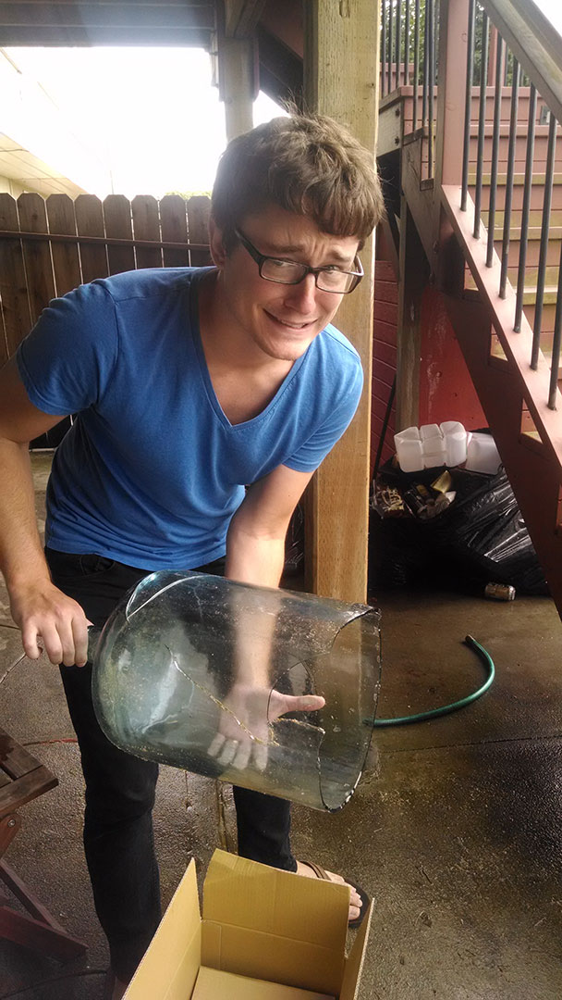

Boudicca's Calamity and Bumblebee's Folly
=========================================

Two catastrophic equipment failures and one deceased bumblebee later, we've
completed our second round of brewing.

Our wort chiller came in a few days later, and we bought some more bottles,
so next time we'll be even better prepared.

Boudica's Calamity
-------------------

A strong Irish Red ale.

* 8.00 lb Pale Malt (2 Row) US (2.0 SRM)
* 1.00 lb Caraaroma (130.0 SRM)
* 0.50 lb Carafoam (2.0 SRM)
* 0.50 lb Melanoiden Malt (20.0 SRM)
* 1.00 oz Crystal [3.50 %] (60 min) (First Wort Hop)
* 1.00 oz Warrior [15.50 %] (5 min)
* 1.00 lb Honey (1.0 SRM) (add at flame out)
* 1 Pkgs California Ale (White Labs #WLP001)

(Malt for 60 minutes at 154.)

This was *supposed* to end up as five gallons. But, I made a dumb mistake.

The original idea was to use the [Raging Red Irish Ale](http://www.homebrewtalk.com/f65/raging-red-irish-red-ale-239188/)
recipe from the homebrewtalk forums, but our first problem arrived when we
realized that the extra package we thought we had of Cascade was actually
Tettnang. So, we made the decision to use the *very* high alpha (15%!)
Warrior hops because it sounded like an interesting thing to do - and to do it
at five minutes. It's probably not actually an Irish Red at this point, but
that's okay, beacuse it smelled *really good*.

Once we shut down the heat, Drew went off to clean and sanitize the equipment
for the next thing we were brewing - our mead - and I decided to go ahead and
move the wort into a carboy so that we could have the pot free for the mead.

I did it hot, through my plastic siphon into the glass carboy. This scene
proceeded:

1. The 200-degree wort started bending the siphon in half.
2. Drew came out, gave me a look of disapproval, and tried bending the siphon
back to fix it. (I smelled the beer and it didn't smell plasticky at all, at
least.)
3. Drew sprayed the excess wort off of the carboy with a hose, which immediately
cracked down the middle and began spewing hot wort everywhere.
4. I put a bottling bucket in front of the carboy, trying to catch as much as
possible, while Drew siphoned as fast as he could into the bucket.
5. Drew picked up the carboy when it was about 3/4 done, which then lost its
bottom (and the rest of the wort) all over the patio.
6. We then chilled the wort in an ice bath, and then started siphoning into
a new carboy. The siphon fell apart, and we used the spigot to transfer.

So, hopefully it doesn't taste like plastic and broken glass. We should still
get a couple dozen bottles out of it, at least. And that's how we got our name:
the Warrior hops in an Irish ale gave rise to the name Boudica, and the...
difficulties... to the name Calamity.

Update 7/29: racked into bucket. Smelled amazing and not at all like plastic.

Bumblebee's Folly
-----------------

* 6lb Orange Blossom honey
* 6lb Hawaiian Wildflower honey
* 3lb specialty honey - "vanilla and toasted marshmallow". Definitely tasted
  like toasted vanilla marshmallows.
* White Labs Sweet Mead yeast

This went swimmingly, without any equipment failures. In fact, it went so well
that a trio of bumblebees came over to check out what the amazing smell was.

One got too close and dropped straight into the hot honey-water. At least he
died enveloped in the smell of heaven.

